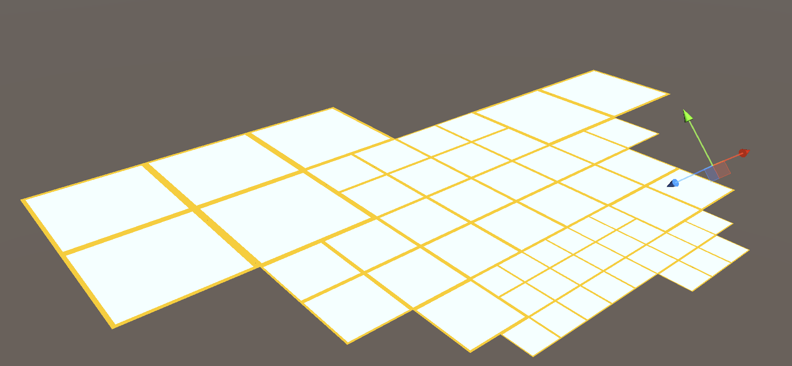
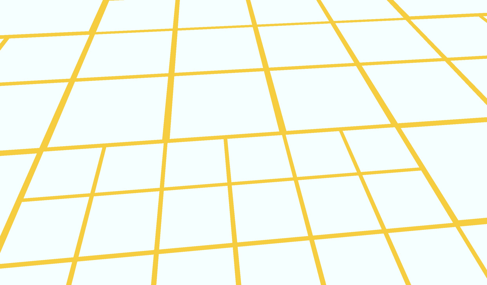
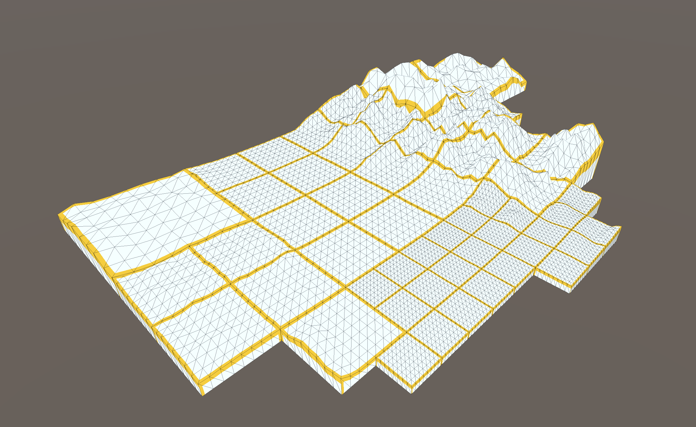
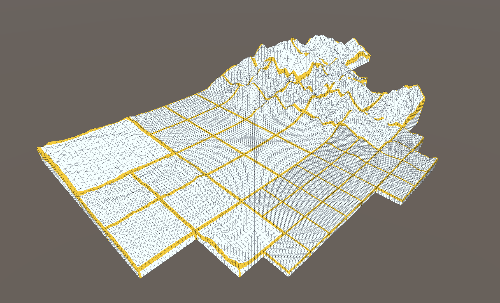
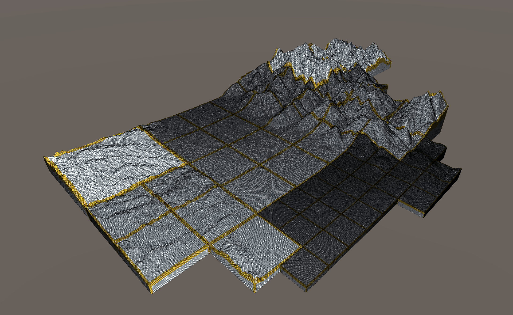

# Karafuto Core. Library for relief maps generation 

#StandWithUkraine 🇺🇦

This project is a small part of my master's thesis.
Library (static or shared) allows you to simplify the creation of three-dimensional relief maps (tile network
generation, generation meshes with elevation and tile raster downloading)
using only projection and view camera matrices.
Tested in Unity, Raylib. Tested on Windows (MinGW and MSVC), MacOS, Linux and Android.

## Based on

- [OpenGL Mathematics (GLM)](https://github.com/g-truc/glm) to matrix manipulation and specific math types
- [HTTPRequest](https://github.com/elnormous/HTTPRequest) for cross-platform GET requests
- [lrucache17](https://github.com/marty1885/lrucache17) for LRU-cache
- stb_image.h from [STB](https://github.com/nothings/stb) for .png and .jpg raster decoding

Special thanks [ViziCities](https://github.com/UDST/vizicities) for inspiration.

## How it works


### Layer declaration

After creating the layer instance and updating the matrices the observable space is updated.
Appeared and disappeared tiles fill the event queue (core events) with `InFrustum` and `NotInFrustum` types.
This queue allows you to create real-time relief scenes.

At the same time, the images are loaded. The results fill in a separate queue (image events) with events with
type `ImageReady`.

The following interface functions are responsible for this process:

```
// Create layer with origin presented in lat. (arg[0]) and lon (arg[1]) with OSM rasters source.
DllExport KCore::LayerInterface *CreateTileLayer(float, float);

// Create layer with origin presented in lat. (arg[0]) and lon (arg[1]) with custom rasters URL (arg[2]).
// for ex. 'http://a.basemaps.cartocdn.com/light_all/{z}/{x}/{y}@2x.png' where '{z}/{x}/{y}'
DllExport KCore::LayerInterface *CreateTileLayerWithURL(float, float, const char *);

// ...so, url for specified layer (arg[0]) may be set in the future (arg[1]) 
DllExport void SetLayerRasterUrl(KCore::LayerInterface *, const char *);


// DISCLAIMER: Y-axis is related to up-vector and heights 

// We can update project (arg[1]) and view (arg[2]) matrices for specified layer (arg[0]) in same time
// Also, we indicate the need to transpose (arg[3] and arg[4])  
DllExport void Update(KCore::LayerInterface *, float *, float *, bool, bool);
// ...or do it separately  
DllExport void UpdateProjectionMatrix(KCore::LayerInterface *, float *, bool);
DllExport void UpdateViewMatrix(KCore::LayerInterface *, float *, bool);

// ...or create matrix on library side from params
// for projection matrix is: fov (arg[0]), aspect ratio (arg[1]), near (arg[2]), far (arg[3]) values 
DllExport void UpdateProjectionMatrixFromParams(KCore::LayerInterface *, float, float, float, float);
// for view matrix is: vector of position (arg[1]) and rotation in radians (arg[2])
DllExport void UpdateViewMatrixFromParams(KCore::LayerInterface *, float *, float *);

// Invoke update process for specified layer (arg[0])
DllExport void Calculate(KCore::LayerInterface *);

// Get pointer to arrays with events
DllExport std::vector<LayerEvent> *GetCoreEventsVector(KCore::LayerInterface *);
DllExport std::vector<LayerEvent> *GetImageEventsVector(KCore::LayerInterface *);
// Get raw pointer and length (ref args[1]) from events vector pointer (args[0]) 
DllExport LayerEvent *EjectEventsFromVector(std::vector<LayerEvent> *, int &);
// Release vector copy memory
DllExport void ReleaseEventsVector(std::vector<LayerEvent> *);
```

The result of one iteration without downloaded rasters:

|                      Out-camera view                      |                      In-camera view                      |
|:---------------------------------------------------------:|:--------------------------------------------------------:|
|  |  |

### Elevation Source

```
// Create an instance of the SRTM-repository that should contain all related SRTM-files 
SRTMElevation *CreateSRTMElevationSource();
 
// Add one file to the repository (arg[0]) with specified URL (arg[1]) and 
// resource type (arg[2]; types described below)   
DllExport void AddSRTMPiece(SRTMElevation*, const char*, SourceType);

// SRTM source can be one from types listed below
enum SourceType {
    SourceFile,         // as file path
    SourceUrl           // as url path
};
```

### Mesh Creation

Using created SRTM-repository you can create elevation meshes at runtime.

```
// Create mesh using TMS-code (arg[1] - zoom, arg[2] - x, arg[3] - y)
// using elevation source (arg[0]) with defined count of x and y segments (arg[4] and arg[5]) 
// and specified neccesary of flipping uv-map in x (arg[6]) and y (arg[7]) 
DllExport GridMesh *CreateTileMeshXYZ(IElevationSource *srcPtr,
                                      uint8_t zoom, uint16_t x, uint16_t y,
                                      uint16_t segmentsX, uint16_t segmentsY,
                                      bool flipUVsX, bool flipUVsY);
     
// Create mesh using tree quadcode (arg[1]) using elevation source (arg[0])
// with defined count of x and y segments (arg[2] and arg[3]) 
// and specified neccesary of flipping uv-map in x (arg[4]) and y (arg[5]) 
DllExport GridMesh *CreateTileMeshQuadcode(IElevationSource *srcPtr,
                                           const char *quadcode,
                                           uint16_t segmentsX, uint16_t segmentsY,
                                           bool flipUVsX, bool flipUVsY);
```

Example of scene with created tiles:

|                           8 segments                           | 16   segments                                                   |                           128 segments                           |
|:--------------------------------------------------------------:|-----------------------------------------------------------------|:----------------------------------------------------------------:|
|  |  |  |

## License

```
/******************************************************************************
 * "THE HUG-WARE LICENSE" (Revision 2): As long as you retain this notice you *
 * can do whatever you want with this stuff. If we meet some day, and you     *
 * think this stuff is worth it, you can give me/us a hug.                    *
******************************************************************************/
```

Please respect the licenses of dependent projects and rewrite freely those sections that do not fit you.

And never forget those you love ❤️