# Karafuto Core

The easiest way to create maps in your native apps (maybe not)

<p align="center">
    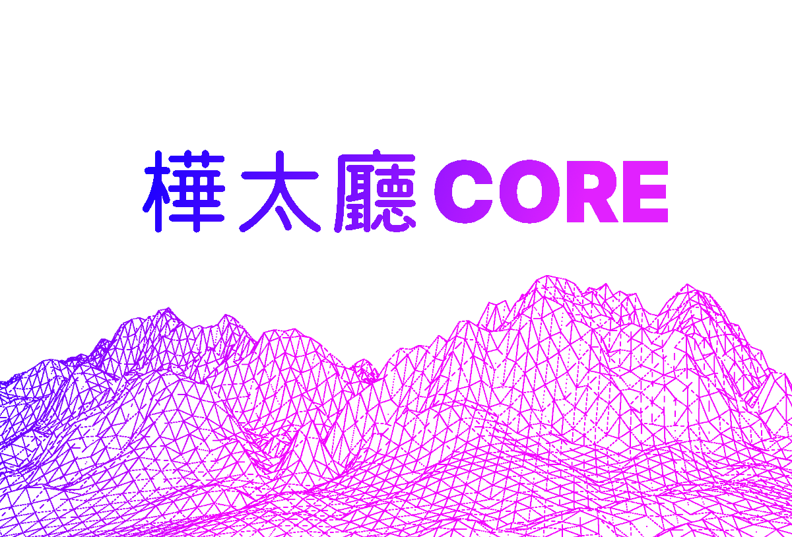
</p>

You implement the renderer yourself. The library gives only a description of your map and ready-made objects, which you can immediately load into the GPU after a little post-processing

### Shortcuts

- [Based on](#based-on)
- [How it works](#how-it-works)
- [Result](#result)
- [TODO](#todo)
- [License](#license)

## Based on

- [OpenGL Mathematics (GLM)](https://github.com/g-truc/glm) to matrix manipulation and store data in vector-like types
- [HTTPRequest](https://github.com/elnormous/HTTPRequest)
- [lrucache17](https://github.com/marty1885/lrucache17) ...I was too lazy to do it myself
- [RapidJSON](https://github.com/Tencent/rapidjson) to GeoJSON parsing
- stb_image.h from [STB](https://github.com/nothings/stb) to decode .png and .jpg tile images
- GPU APIs
    - Vulkan
    - OpenCL (1.2 version for GPUs that not support Vulkan for any reasons)

Special thanks for [ViziCities](https://github.com/UDST/vizicities)

## How it works

Using the two camera matrices: the projection matrix and the view matrix, the observable space is subdivided. Its description is sent to the queue, which can be read on the application side.

```
// update layer        
DllExport void UpdateLayer(KCore::LayerInterface *corePtr, float *cameraProjectionMatrix,
                            float *cameraViewMatrix, float *cameraPosition);

// get pointer to events queue copy                             
DllExport std::vector<LayerEvent> *GetEventsVector(KCore::LayerInterface *layerPtr);
```

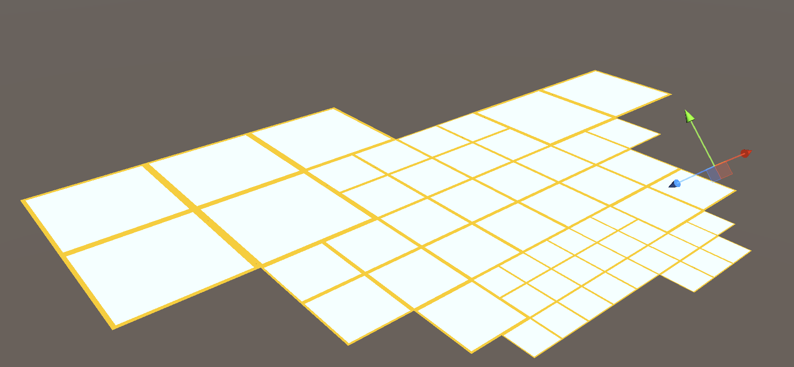

The result is the following view of the scene:

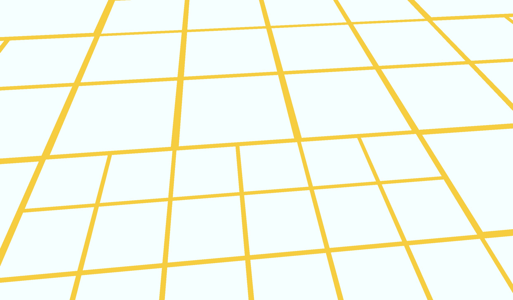

### Layer core

First, you need to create an instance of the layer that implements all the logic of the library

```
// create layer that use OSM rasters
DllExport KCore::LayerInterface *CreateTileLayerOSM(float latitude, float longitude);

// create layer that use custom tile service for ex. 'http://a.basemaps.cartocdn.com/light_all/{z}/{x}/{y}@2x.png' where '{z}/{x}/{y}' is necessary
DllExport KCore::LayerInterface *CreateTileLayerWithURL(float latitude, float longitude, const char *url);
```

### Subdivision modes

After creating a layer, you can choose the subdivision mode and the type of backend in the case of the two-pass subdivision.

|                        Naive subdivision                        |                                 Two-pass subdivision                                 |
|:---------------------------------------------------------------:|:------------------------------------------------------------------------------------:|
|                   |                    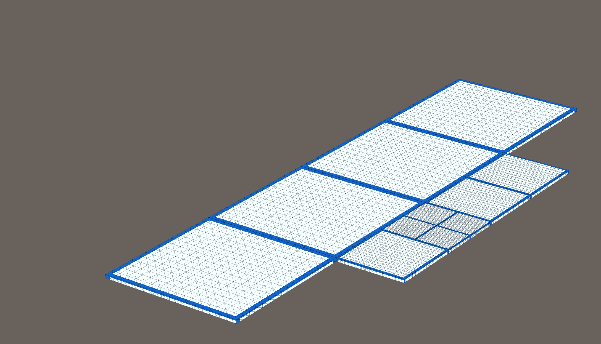                    |
|            Calculation of high-resolution LOD model             | Calculation of a low-resolution LOD model with an additional high-resolution pass... |
| 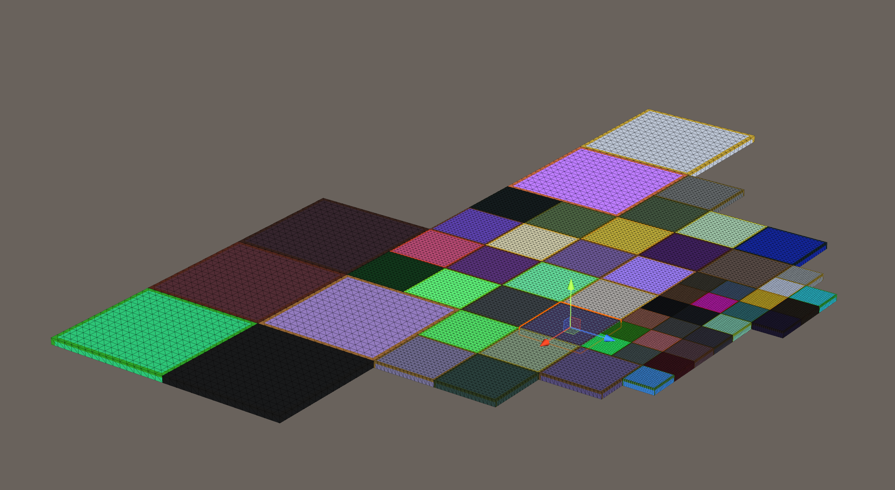 |             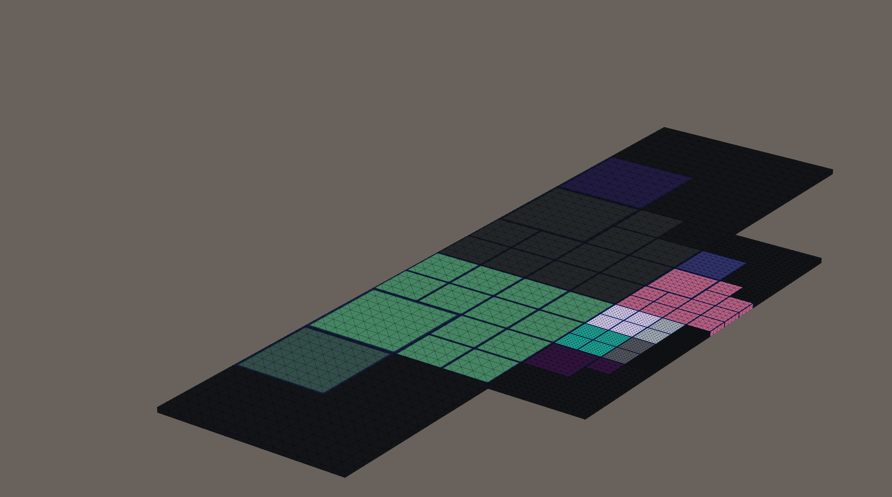             |


The second pass associates small tiles with large ones, which will become the basis for future Vulkan or OpenCL renderings like that:

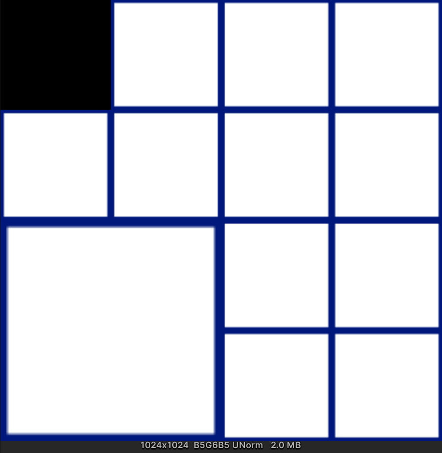

```
// select subdivision mode after core creation
DllExport void SetLayerMode(KCore::LayerInterface *corePtr, LayerMode mode, float param1, float param2);

// where layer mode can be 
enum LayerMode {
    OneToOneLOD,          // naive
    OneToSubdivisionLOD   // two-pass
};

// select backend mode after core creation
DllExport void SetBackendMode(KCore::LayerInterface *corePtr, BackendMode mode);

// where backend mode can be 
enum BackendMode {
    NonProcessing,        // send raster to queue after loading without additional rendering
    Vulkan,
    OpenCL
};
```


### Elevation sources


```
// process GeoJSON file and try to get elevation value from related SRTM source 
SRTMElevation* CreateSRTMElevationRepo();
 
// process GeoJSON file and without elevation search  
DllExport void SRTMElevationRepoAddSource(SRTMElevation* srcPtr, const char* path, SourceType type);

<...>

// SRTM source can be one from types listed below
enum SourceType {
    SourceFile,         // as file path
    SourceUrl           // as url path
};
```

### Tile meshes with elevation

The created source of heights allows to search heights at the moment of creation of mash tiles

|                      8 Segments                       |                     16   Segments                      |                      128 Segments                       |
|:-----------------------------------------------------:|--------------------------------------------------------|:-------------------------------------------------------:|
| 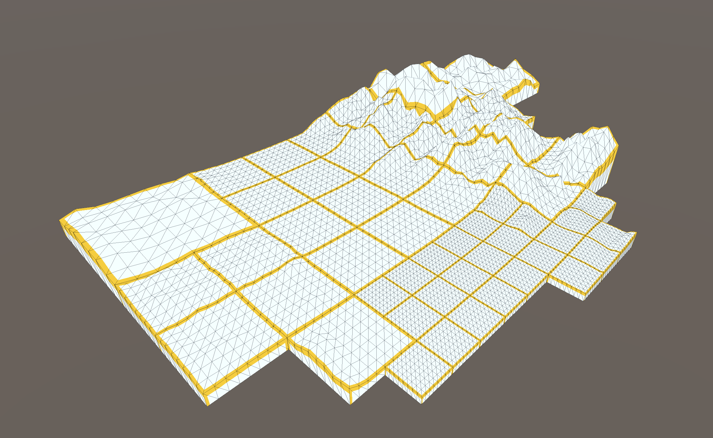 | 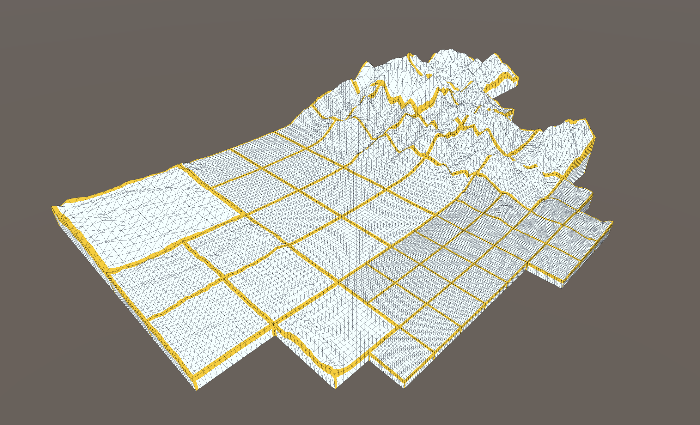 | 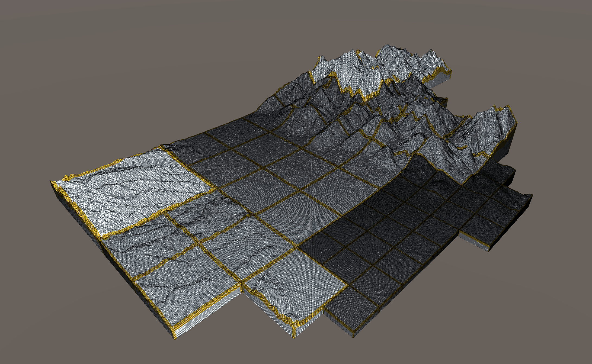 |

```
// create tile using TMS-code with count of segments passed in 5 and 6 arguements  
DllExport GridMesh *CreateTileMeshXYZ(IElevationSrc *srcPtr, uint8_t zoom,
                                      uint16_t x, uint16_t y,
                                      uint16_t slicesX, uint16_t slicesY,
                                      bool flipUVsX, bool flipUVsY);
                                      
// create tile using Quadcode with count of segments passed in 3 and 4 arguements  
DllExport GridMesh *CreateTileMeshQuadcode(IElevationSrc *srcPtr, const char *quadcode,
                                           uint16_t slicesX, uint16_t slicesY,
                                           bool flipUVsX, bool flipUVsY);
```

### GeoJSON meshes

The built-in GeoJSON processing functionality is capable of creating meshes for Polygon, Point and Polyline types. If you pass in the elevation source argument, the elevation value will be added to the object

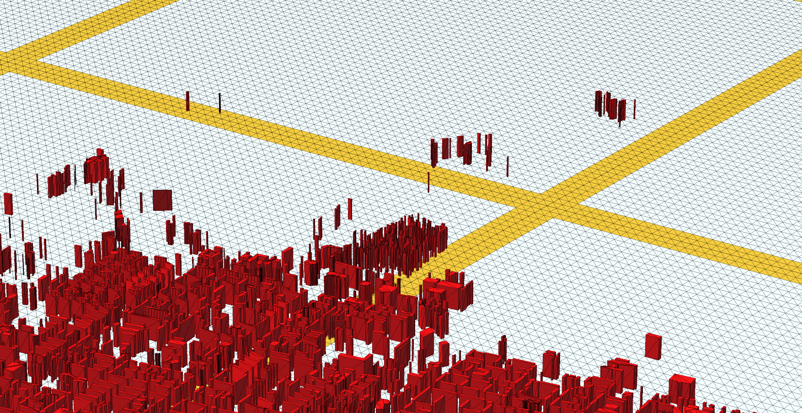
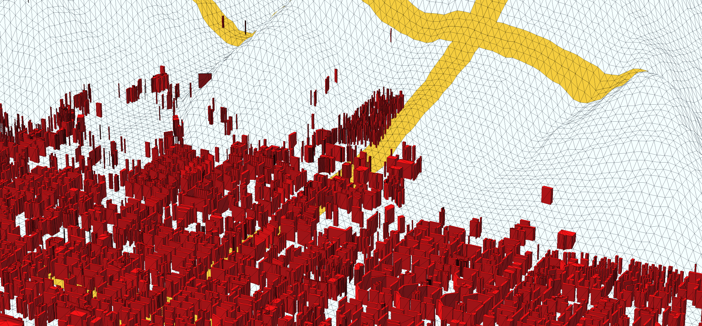 

```
// process GeoJSON file and try to get elevation value from related SRTM source 
DllExport std::vector<GeoJSONTransObject> *
ProcessGeoJSONWithElevation(LayerInterface *layerPtr, IElevationSrc *elevation, GeoJSONSourceType type, const char *param);
 
// process GeoJSON file without elevation search  
DllExport std::vector<GeoJSONTransObject> *
ProcessGeoJSON(LayerInterface *layerPtr, GeoJSONSourceType type, const char *param);

<...>

// GeoJSON source can be one from types listed below
enum GeoJSONSourceType {
    GeoJSONRaw,         // as string text 
    GeoJSONFile,        // as file path
    GeoJSONUrl          // as url path
};
```

### Result

The result of combining all these functions is a dynamic relief scene

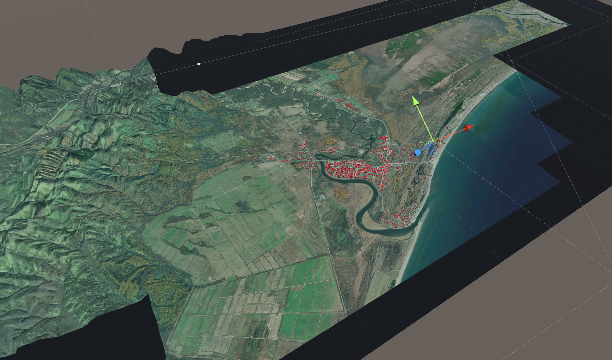

## TODO

- :black_square_button: - CMake for MacOS and Linux
- :black_square_button: - Make it compatible with iOS
- :black_square_button: - GeoTIFF
- :black_square_button: - Tests 

## License

I don't know which license to choose... Let it be this one. 

```
/******************************************************************************
 * "THE HUG-WARE LICENSE" (Revision 2): As long as you retain this notice you *
 * can do whatever you want with this stuff. If we meet some day, and you     *
 * think this stuff is worth it, you can give me/us a hug.                    *
******************************************************************************/
```

Please respect the licenses of dependent projects and rewrite freely those sections that do not fit you.
And never forget those you love ❤️

[//]: # (If you think my skills could be useful and you can offer work in Eastern Europe, contact me :&#41;)